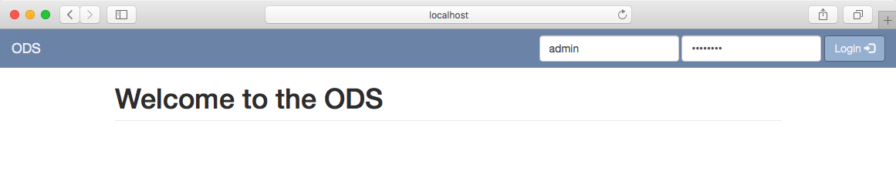
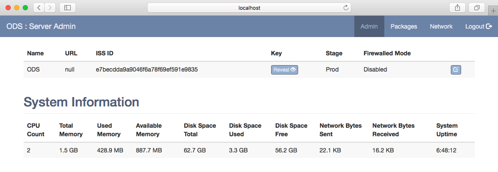
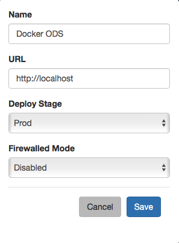

Initial Setup
=============

Login
-----

During first time initialization, the ODS application will set an initial
administrator user account to access the web UI and Admin API.

    Username: `admin`
    Password: `ods1234!`

.. warning::

    You will be able to change this account, and add others with restricted
    permissions, in a later update.

Server Administration
---------------------

Under the `Admin` tab you can view the current server settings and information
on the system's resources and activities.

Before you can register the ODS to another ODS you must set the `Name` and
`URL`. Click the `Edit` button on the right to open the settings modal to make
your modifications.

