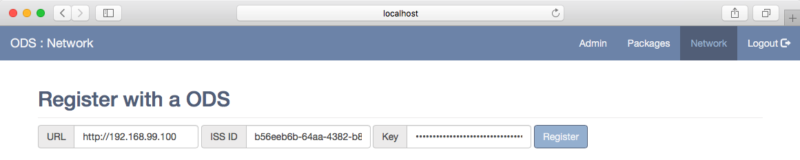
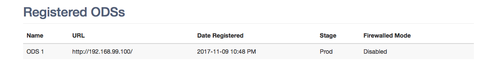

ODS Registration
================

Under the `Network` tab you will have options for registering with other ODS
applications. Registration allows ODS instances to communicate with each other
and sync files and changes to those files.

To perform the registration you will need the `URL`, `ISS ID`, and `Key` of the
remote ODS you are registering with. Enter the values into the provided fields
and click `Register`.

Upon a successful registration you will see the remote ODS appear in the list of
registered instances. If not, an error message banner will be displayed on the
page.

