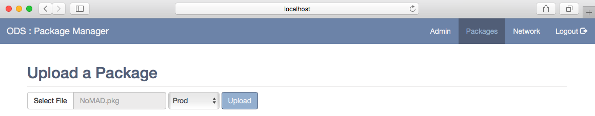
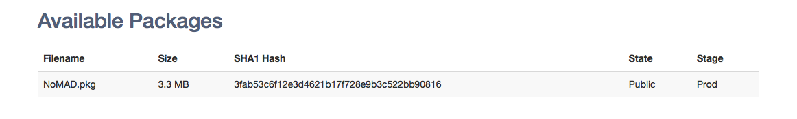

Package Management
==================

Under the `Packages` tab you will be able to upload files to the ODS to make
available for download. If you have registered with other ODS instances they
will receive notifications to sync the package.

Click the `Select File` button and browse for the file to upload. Select a
`Stage` to associate with the file and click `Upload`. The `Upload` button will
become grayed out during this process.

Upon a successful upload the page will reload and display the new file.

If the server is syncing a file from another ODS it will appear in this list
with a `Downloading` status. Upon completion this will change to display
`Public` meaning the file is available for download.
